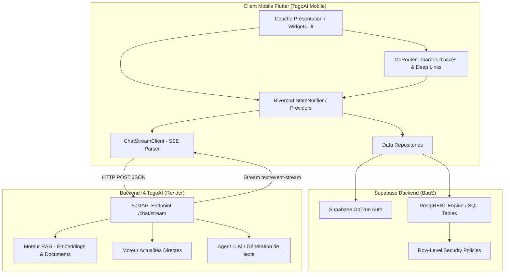
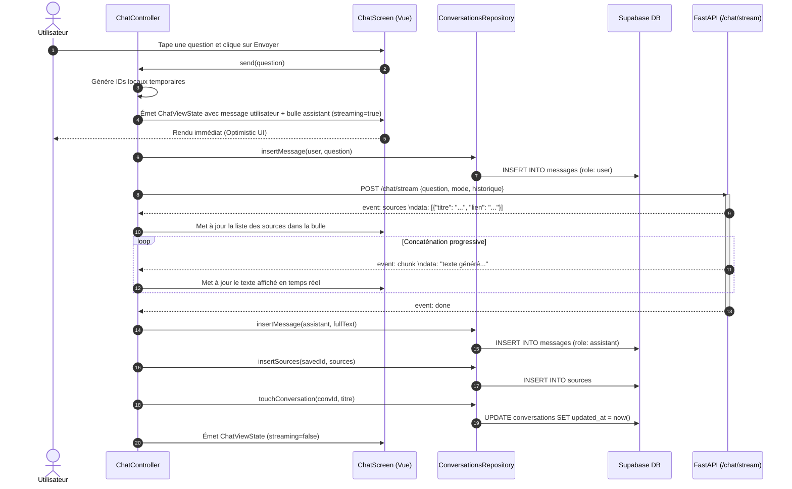
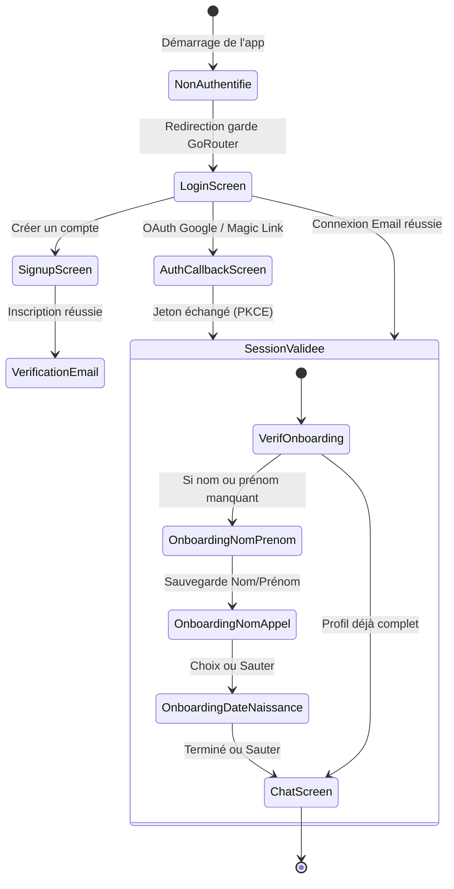

<!--
Date : 29/09/2026
Auteurs : Elpidio Alexis AMOUSSOU
          Eli Yannick HOVI
Emails : amoussouelpidioalexis@gmail.com
         yannickeli2007@gmail.com
But : Spécifications et choix d'architecture logicielle de l'application TogoAI Mobile (gestion d'état Riverpod, flux de chat SSE, intégration Supabase).
-->

# 🏛️ Architecture Logicielle — TogoAI Mobile

Ce document détaille les principes architecturaux, les choix techniques, les flux de données et les protocoles de sécurité qui régissent l'application **TogoAI Mobile**.

---

## 📑 Table des Matières

1. [Philosophie Architecturale](#1-philosophie-architecturale)
2. [Cartographie Globale du Système](#2-cartographie-globale-du-système)
3. [Décomposition par Couches (Clean Architecture)](#3-décomposition-par-couches-clean-architecture)
4. [Gestion d'État Réactive avec Riverpod](#4-gestion-détat-réactive-avec-riverpod)
5. [Protocole de Chat en Streaming SSE](#5-protocole-de-chat-en-streaming-sse)
6. [Tunnel d'Authentification, OAuth & Sécurité](#6-tunnel-dauthentification-oauth--sécurité)
7. [Modélisation des Données & Politiques RLS](#7-modélisation-des-données--politiques-rls)
8. [Design System & Internationalisation](#8-design-system--internationalisation)
9. [Résolution Réseau & Bouclage Émulateur](#9-résolution-réseau--bouclage-émulateur)
10. [Stratégie de Test & Qualité](#10-stratégie-de-test--qualité)

---

## 1. Philosophie Architecturale

TogoAI Mobile est conçue selon une approche combinant **Clean Architecture** et organisation **Feature-First** (par domaine métier).

### Piliers directeurs :
- **Séparation stricte des responsabilités (SoC)** : La couche de présentation ignore les spécificités de transport HTTP ou du moteur SQL de Supabase.
- **Immuabilité systématique** : Tous les modèles et états d'affichage (`ChatViewState`, `ChatMessage`, `UserProfile`) sont immuables et clonés via des méthodes `copyWith()`.
- **Tolérance aux pannes & Optimistic UI** : L'interface utilisateur reflète instantanément les actions de l'utilisateur avant même la confirmation réseau du backend.
- **Zéro fuite mémoire** : Cycle de vie automatisé des contrôleurs via les fonctionnalités `autoDispose` de Riverpod et annulation explicite des souscriptions de streaming.

---

## 2. Cartographie Globale du Système



---

## 3. Décomposition par Couches (Clean Architecture)

L'arborescence logicielle est articulée en 4 strates :

### A. Couche Core (`lib/core/`)
Socle transverse agnostique des fonctionnalités :
- `config/app_config.dart` : Injection à la compilation (`--dart-define`), constantes d'exécution, résolution d'URL.
- `router/app_router.dart` : Arbre déclaratif de navigation GoRouter, redirection d'authentification et gestionnaire de pile.
- `theme/togo_colors.dart` & `theme/app_theme.dart` : Tokens sémantiques, palettes lumineuses/sombres et adaptation au thème système.

### B. Couche Data (`features/*/data/`)
Responsable de l'acquisition, du mapping et de la persistance des données :
- `ConversationsRepository` : Exécution des requêtes CRUD PostgREST, extraction de titre heuristique et association des sources.
- `AuthRepository` : Abstraction de l'authentification email/mot de passe, OAuth Google, soft-delete et profils.
- `ChatStreamClient` : Décodeur SSE bas niveau lisant les événements `\n\n` sans dépendance tierce lourde.

### C. Couche Domain & State (`shared/providers/` & `features/*/presentation/`)
Orchestration de la logique métier et maintien des états :
- `ChatController` (`StateNotifier<ChatViewState>`) : Machine à états régissant la discussion, la composition, le streaming et les réessais.
- `authProvider` : Exposition sous forme de `StreamProvider` de la session Supabase active.
- `themeModeProvider` & `localeProvider` : Synchronisation bidirectionnelle avec le stockage local `SharedPreferences` et la base distante.

### D. Couche Presentation (`features/*/presentation/` & `shared/widgets/`)
Composants déclaratifs Flutter :
- Écrans (`ChatScreen`, `LoginScreen`, `SignupScreen`, `SettingsSheet`, etc.).
- Composants partagés (`TogoPrimaryButton`, `TogoTextField`, `TogoChoiceChip`).
- Identité visuelle (`AuthHeader`, `TogoLogoWordmark`, `TogoLogoBadge`).

---

## 4. Gestion d'État Réactive avec Riverpod

Riverpod 2.x a été retenu au détriment de BLoC ou Provider pour plusieurs raisons architecturales majeures :

1. **Suppression du BuildContext pour la lecture d'état** : Les repositories et services peuvent lire les sessions sans dépendre de l'arbre des widgets.
2. **Cycle de vie granulaire (`autoDispose`)** : Le `chatControllerProvider` est une famille indexée par `conversationId`. Lorsqu'un utilisateur quitte un salon de discussion, les contrôleurs et les flux résiduels sont automatiquement purgés de la mémoire.
3. **Sécurité à la compilation** : Les dépendances circulaires sont détectées et les états asynchrones sont typés de manière exhaustive via `AsyncValue`.

```dart
// Fournisseur auto-dispose indexé par identifiant de conversation
final chatControllerProvider = StateNotifierProvider.autoDispose
    .family<ChatController, ChatViewState, String?>((ref, conversationId) {
  return ChatController(ref, conversationId: conversationId);
});
```

---

## 5. Protocole de Chat en Streaming SSE

### Séquence d'un échange conversationnel



### Parsing robuste du flux SSE
Le [ChatStreamClient](file:///c:/Users/amous/Desktop/Projets/TogoAI-Mobile/lib/features/chat/data/chat_stream_client.dart) découpe le flux continu d'octets UTF-8 en paquets délimités par des doubles sauts de ligne (`\n\n`). Il supporte les fragmentations arbitraires de trames TCP grâce à un tampon mémoire interne (`buffer`).

---

## 6. Tunnel d'Authentification, OAuth & Sécurité

### Machine à États de Navigation Post-Auth



### Protocole de Soft-Delete sécurisé
Pour se conformer aux exigences de confidentialité et de suppression de compte imposées par l'Apple App Store et Google Play, TogoAI implémente une procédure sécurisée :
1. **Ré-authentification obligatoire** : Le compte doit prouver son identité (mot de passe actuel ou session Google récente de moins de 5 minutes).
2. **Confirmation explicite** : L'utilisateur doit saisir le mot-clé exact `SUPPRIMER`.
3. **Exécution atomique** : Un appel RPC ou une mise à jour enregistre l'horodatage `deleted_at = now()`. Les accès ultérieurs sont bloqués dès l'écran de connexion par une exception métier dédiée (`compte_supprime`).

---

## 7. Modélisation des Données & Politiques RLS

Les interactions avec la base de données Supabase s'exécutent avec la clé publique `SUPABASE_ANON_KEY`, sous le contrôle rigoureux des règles **Row-Level Security (RLS)** :

```
┌─────────────────────────────────┐
│              users              │
├─────────────────────────────────┤
│ id: uuid (PK, references auth)  │
│ nom: text                       │
│ prenom: text                    │
│ nom_appel: text                 │
│ date_naissance: date            │
│ theme: text                     │
│ language: text                  │
│ deleted_at: timestamp with tz   │
└────────────────┬────────────────┘
                 │ 1
                 │
                 │ N
┌────────────────▼────────────────┐
│          conversations          │
├─────────────────────────────────┤
│ id: uuid (PK)                   │
│ user_id: uuid (FK -> users.id)  │
│ titre: text                     │
│ created_at: timestamp with tz   │
│ updated_at: timestamp with tz   │
└────────────────┬────────────────┘
                 │ 1
                 │
                 │ N
┌────────────────▼────────────────┐
│            messages             │
├─────────────────────────────────┤
│ id: uuid (PK)                   │
│ conversation_id: uuid (FK)      │
│ role: text (user | assistant)   │
│ contenu: text                   │
│ mode: text (rag | realtime)     │
│ created_at: timestamp with tz   │
└────────────────┬────────────────┘
                 │ 1
                 │
                 │ N
┌────────────────▼────────────────┐
│             sources             │
├─────────────────────────────────┤
│ id: uuid (PK)                   │
│ message_id: uuid (FK)           │
│ titre: text                     │
│ source_nom: text                │
│ lien: text                      │
└─────────────────────────────────┘
```

> **Contrainte RLS** : Un utilisateur ne peut lire, insérer ou supprimer que les enregistrements dont la colonne `user_id` correspond à son jeton `auth.uid()`.

---

## 8. Design System & Internationalisation

### Design Tokens TogoColors
La palette sémantique est définie dans [togo_colors.dart](file:///c:/Users/amous/Desktop/Projets/TogoAI-Mobile/lib/core/theme/togo_colors.dart) et exposée via une extension de contexte :

```dart
final colors = context.togo;
// Accès typé aux tokens :
// colors.accent, colors.userBubble, colors.bgCard, colors.border, colors.danger
```

### Synchronisation i18n
La langue sélectionnée par l'utilisateur (Français, Anglais, Éwé) est stockée localement dans les `SharedPreferences` et synchronisée de façon asynchrone dans le profil Supabase de l'utilisateur (`users.language`). Cela garantit une parité d'expérience parfaite entre les versions Web et Mobile.

---

## 9. Résolution Réseau & Bouclage Émulateur

Dans les environnements mobiles, l'adresse de bouclage `localhost` est source d'erreurs fréquentes :
- Sur **Android Emulator**, `localhost` désigne la machine virtuelle Android. Pour contacter l'hôte de développement, l'IP virtuelle `10.0.2.2` est requise.
- Sur **navigateur Web**, `localhost` ou `127.0.0.1` cible la machine locale.

La classe [AppConfig.resolvedBackendUrl](file:///c:/Users/amous/Desktop/Projets/TogoAI-Mobile/lib/core/config/app_config.dart#L51) détecte automatiquement la cible Android en mode hors-web et convertit silencieusement les URLs de loopback.

---

## 10. Stratégie de Test & Qualité

La fiabilité du code repose sur 3 niveaux de vérification :

1. **Tests Unitaires (`test/chat_unit_test.dart`)** : Validation de la logique pure sans framework UI (nettoyage heuristique des titres de discussion, immuabilité des modèles, sérialisation des sources).
2. **Tests d'Intégration & Widgets (`test/widget_test.dart`)** : Vérification du rendu des composants fondamentaux dans un environnement d'émulation de rendu.
3. **Analyse Statique Stricte (`analysis_options.yaml`)** : Respect des règles officielles Dart/Flutter avec détection des variables inutilisées, des casts non sécurisés et des imports redondants.

---

## 👥 Auteurs & Référents Techniques

- **Elpidio Alexis AMOUSSOU** — [amoussouelpidioalexis@gmail.com](mailto:amoussouelpidioalexis@gmail.com)
- **Eli Yannick HOVI** — [yannickeli2007@gmail.com](mailto:yannickeli2007@gmail.com)
